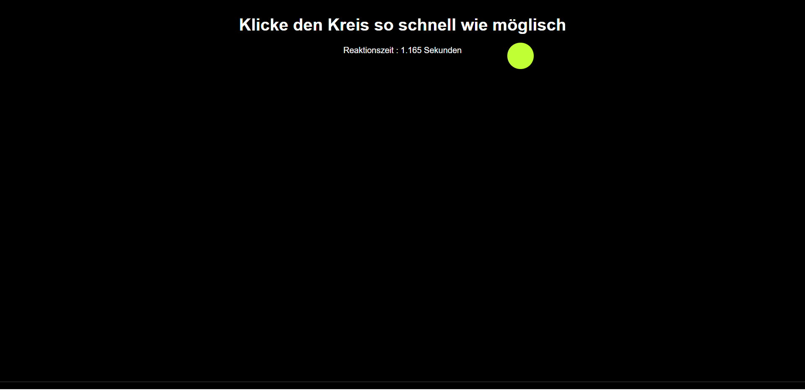

# 🎯 Reaktionsspiel

In diesem Projekt habe ich ein kleines interaktives **Reaktionsspiel mit HTML, CSS und JavaScript** entwickelt.  
Das Ziel des Spiels ist es, die Reaktionsgeschwindigkeit des Nutzers zu messen.

## 📸 Projektvorschau 

### 🌐 Der Link
[Hier klicken, um den Reaktionsspiel zu testen]([https://black-lock.github.io/Taschenrechner/](https://black-lock.github.io/Reaktionsspiel/))

## 🧩 Funktionsweise

Beim Laden der Seite erscheint ein Kreis an einer zufälligen Position auf dem Bildschirm.  
Die Aufgabe des Spielers ist es, **den Kreis so schnell wie möglich anzuklicken**.  

Sobald der Kreis angeklickt wird:

I. Die Zeit zwischen dem Erscheinen des Kreises und dem Klick wird berechnet.
II. Die Reaktionszeit wird auf dem Bildschirm angezeigt.
III. Der Kreis bewegt sich automatisch an eine neue zufällige Position.
IV. Zusätzlich erhält der Kreis jedes Mal eine **neue zufällige Farbe**.

Dadurch entsteht ein einfaches, aber dynamisches Spiel, das die **Reaktionsgeschwindigkeit des Nutzers testet**.

## ⚙️ Technische Umsetzung

- **HTML**  
  Struktur der Spieloberfläche mit Titel, Statusnachricht und dem klickbaren Kreis.

- **CSS**  
  Gestaltung des Kreises und der Seite, einschließlich Positionierung und visuellem Layout.

- **JavaScript**  
  Implementierung der Spiellogik:
  - zufällige Position des Kreises auf dem Bildschirm
  - zufällige Farbänderung
  - Messung der Reaktionszeit mit Zeitstempeln
  - Aktualisierung der Anzeige nach jedem Klick

## 🚀 Lernziele

Mit diesem Projekt konnte ich:

- DOM-Manipulation mit JavaScript üben  
- zufällige Werte für Position und Farben generieren  
- Benutzerinteraktionen über Events verarbeiten  
- einfache Spielmechaniken im Browser umsetzen  

Dieses Projekt zeigt mein Interesse daran, **interaktive Webanwendungen zu entwickeln und JavaScript für dynamische Benutzererfahrungen einzusetzen.**

## Viel Spaß 😊
